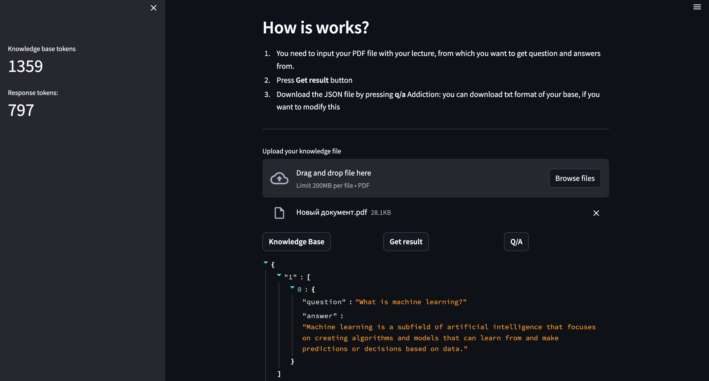
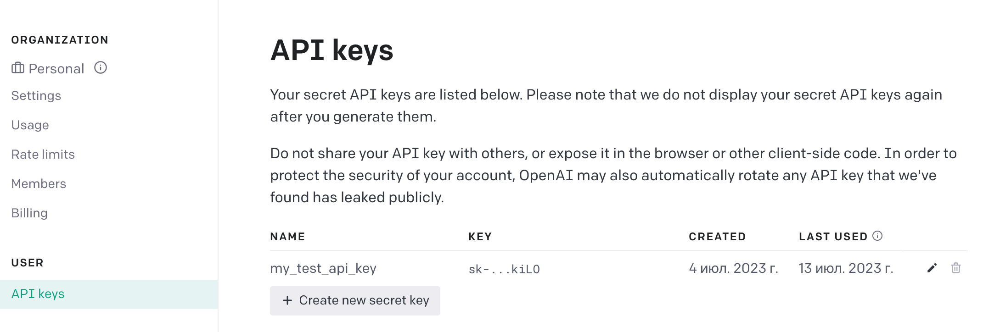

# Q/A using OpenAI API

> ### Create Q/A json file, to prepare for your exams
---
### GUI


# Setup

## Critical prerequisites to install

* run ```pip3 install -r requirements.txt```

* **Rename the file `.env.example` to `.env`**

* Recommended python version `3.9` +
---

### How to Generate an OpenAI API key
1. Go to https://platform.openai.com/account/api-keys

2. Click Create new secret key

   

3. Store the SECRET KEY to `.env` under the `OPENAI_API_KEY`

## Run GUI

in project directory run `streamlit run streamapp.py`